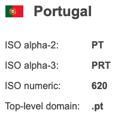

# Country flags


Simple Javascript/CSS script to display country flags (and also ISO country code info). Flags are 32x32 pixels with transparent background.

See it running live [here](https://luciopaiva.com/country-flags).

## How to use it

Copy the files inside the `/dist` folder into your project. In your HTML's `<header>` section, include the CSS script and the JS file:

```html
<link rel="stylesheet" href="country-flag.css">
<script src="country-flag.js"></script>
```

### Displaying a flag

To display a flag image, choose an element in your layout which will be the parent of the DIV element containing the image and pass it to the `CountryFlag` constructor:

```javascript
const parentElement = document.getElementById("my-parent-element");
const flag = new CountryFlag(parentElement);
```

Now you have a flag element ready to show a country flag. The final step is to tell which flag to load. You can do this based on the ISO alpha-2 country code:

```javascript
flag.selectByAlpha2("pt");
```

And the flag will be shown. You can also select a country be ISO alpha-3, ISO numeric code or by top-level domain:

```javascript
flag.selectByAlpha3("cub");
flag.selectByIsoNumeric(388);
flag.selectByTopLevelDomain("uk");
```

### Getting extra country info

Besides the flag, you can also query for the country's name (only available in English), alpha-2, alpha-3, ISO numeric and top-level domain. Just like with flag images, you can get a country by any of the available codes:

```javascript
CountryFlag.getCountryByAlpha2("br");
CountryFlag.getCountryByAlpha3("usa");
CountryFlag.getCountryByIsoNumeric(826);
CountryFlag.getCountryByTopLevelDomain("de");
```

*Note: beware these are static methods, called via the `CountryFlag` class, not via the instance.*

All these methods return a `CountryFlagInfo` object containing the following properties:

```javascript
/**
 * @typedef {Object} CountryFlagInfo
 * @property {Number} isoNumeric
 * @property {String} alpha2
 * @property {String} alpha3
 * @property {String} topLevelDomain
 * @property {String} name
 */
```

For example, this is data for Portugal:



Check the [example page](https://luciopaiva.com/country-flags) for a complete working example.

## Acknowledgements

Thanks [countrycode.org](https://countrycode.org) for providing free ISO data and [flag-sprites.com](https://www.flag-sprites.com/) for free flag images.
